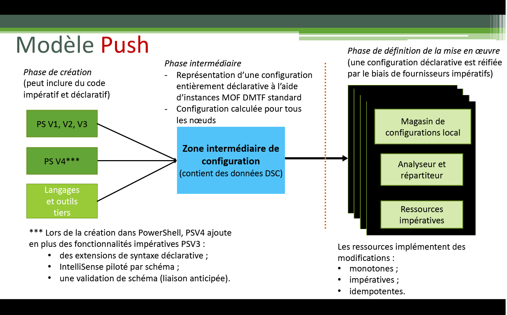
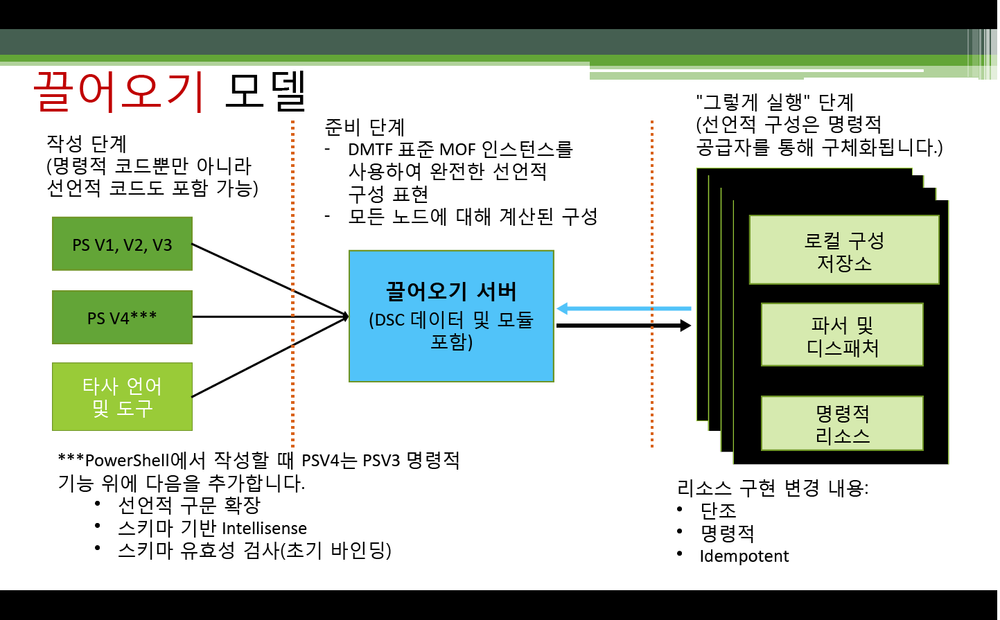

# 구성 시행

>적용 대상: Windows PowerShell 4.0, Windows PowerShell 5.0

PowerShell DSC(필요한 상태 구성) 구성을 시행하는 방법에는 밀어넣기 모드와 끌어오기 모드, 이렇게 두 가지가 있습니다.

## 밀어넣기 모드

밀어넣기 모드는 [Start-DscConfiguration](https://technet.microsoft.com/en-us/library/dn521623.aspx) cmdlet을 호출하여 대상 노드에 구성을 적극적으로 적용하는 사용자를 참조합니다.

구성을 만들고 컴파일한 후에는 [Start-DscConfiguration](https://technet.microsoft.com/en-us/library/dn521623.aspx) cmdlet을 호출하고 cmdlet의 -Path 매개 변수를 구성 MOF가 있는 경로로 설정하여 밀어넣기 모드에서 구성을 시행할 수 있습니다. 예를 들어, 구성 MOF가 `C:\DSC\Configurations\localhost.mof`에 있으면, 다음 명령을 사용하여 로컬 컴퓨터에 적용합니다.
`Start-DscConfiguration -Path 'C:\DSC\Configurations'`

> __참고__: 기본적으로 DSC는 구성을 백그라운드 작업으로 실행합니다. 구성을 대화형으로 실행하려면 __-Wait__ 매개 변수로 [Start-DscConfiguration](https://technet.microsoft.com/en-us/library/dn521623.aspx)을 호출합니다.

클라우드 배포 엔진은 일반적으로 더 광범위한 배포 솔루션의 내부에서 끌어오기 모드를 활용합니다.  예를 들어 Microsoft Azure에서는 가상 컴퓨터를 위한 [DSC 확장](https://azure.microsoft.com/en-us/documentation/articles/virtual-machines-extensions-features/)을 제공합니다.  이것은 배포의 일부로서 가상 컴퓨터 내에서 추출 및 실행되는 보관 파일에 구성 스크립트와 모든 필수 DSC 모듈을 포함하는 옵션을 제공합니다.  

## 끌어오기 모드

끌어오기 모드에서는 끌어오기 클라이언트가 해당 클라이언트의 필요한 상태 구성을 원격 끌어오기 서버에서 가져오도록 구성됩니다. 마찬가지로, 끌어오기 서버는 DSC 서비스를 호스트하도록 설정되었으며 끌어오기 클라이언트에 필요한 구성과 리소스로 프로비전되었습니다.
각 끌어오기 클라이언트에는 노드의 구성에 대해 주기적인 준수 확인을 수행하는 예약된 작업이 있습니다. 이벤트가 처음으로 트리거되면 끌어오기 클라이언트의 LCM(로컬 구성 관리자)이 구성에 대한 유효성 검사를 수행합니다. 끌어오기 클라이언트가 원하는 대로 구성되면 아무 일도 발생하지 않습니다. 원하는 대로 구성되지 않으면 LCM에서는 끌어오기 서버에게 지정된 구성을 가져오라고 요청합니다. 해당 구성이 끌어오기 서버에 존재하고 초기 유효성 검사를 통과하면 이 구성은 끌어오기 클라이언트로 전송된 후 여기에서 LCM에 의해 실행됩니다.

DSC 끌어오기 서버 온-프레미스 배포에 대한 자세한 내용은 DSC 끌어오기 서버 구성 및 계획 가이드를 참조하세요.

온라인 서비스를 활용하여 끌어오기 서버 기능을 호스트하려는 경우에는 [Azure 자동화 DSC](https://azure.microsoft.com/en-us/documentation/articles/automation-dsc-overview/) 서비스를 참조하세요.

다음 항목에서는 끌어오기 서버 및 클라이언트를 설정하는 방법에 대해 설명합니다.

- [웹 끌어오기 서버 설정](pullServer.md)
- [Setting up an SMB pull server(SMB 끌어오기 서버 설정)](pullServerSMB.md)
- [Configuring a pull client(끌어오기 클라이언트 구성)](pullClientConfigID.md)<!--HONumber=Feb16_HO4-->
