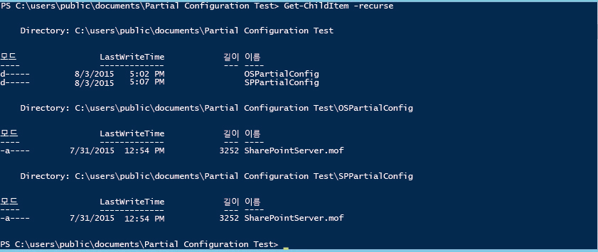
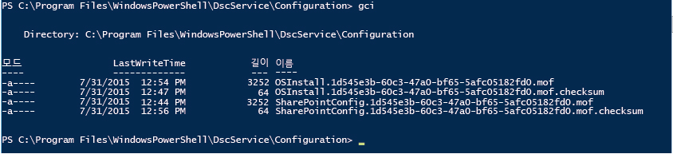

# PowerShell 필요한 상태 구성 부분 구성

>적용 대상: Windows PowerShell 5.0

PowerShell 5.0에서 DSC(필요한 상태 구성)를 사용하면 구성을 여러 소스에서 조각화하여 제공할 수 있습니다. 대상 노드의 LCM(로컬 구성 관리자)은 이 조각들을 한데 모아 하나의 구성으로 적용합니다. 이 기능을 사용하면 구성에 대한 제어권을 팀이나 개인들 간에 공유할 수 있습니다. 예를 들어 두 개 이상의 개발자 팀이 어떤 서비스에 대해 공동으로 작업 중인 경우 이들은 각각 서비스의 해당 부분을 관리하는 구성을 만들 수 있습니다. 이 구성들의 각각은 서로 다른 끌어오기 서버에서 가져올 수 있으며, 개발의 서로 다른 단계에서 추가할 수 있습니다. 부분 구성은 또한 서로 다른 개인이나 팀이 단일 구성 문서에 대한 편집 작업을 조정하지 않고도 노드 구성의 다양한 측면을 제어할 수 있도록 해줍니다. 예를 들어 한 팀은 VM과 운영 체제를 배포하는 일을 담당하고, 다른 팀은 해당 VM에서 다른 응용 프로그램과 서비스를 배포할 수도 있습니다. 부분 구성을 사용하면 어느 한 팀이 불필요하게 복잡해지지 않고 각 팀이 해당 팀의 구성을 만들 수 있습니다.

밀어넣기 모드, 끌어오기 모드 또는 두 모드의 조합 모드에서 부분 구성을 사용할 수 있습니다.

## 밀어넣기 모드의 부분 구성
밀어넣기 모드에서 부분 구성을 사용하려면 부분 구성을 받도록 대상 노드의 LCM을 구성합니다. 각 부분 구성은 Publish-DSCConfiguration cmdlet을 사용하여 대상에 밀어넣어야 합니다. 그런 다음 대상 노드가 부분 구성을 단일 구성으로 결합하면 작업자는 [Start-DscConfiguration](https://technet.microsoft.com/en-us/library/dn521623.aspx) cmdlet을 호출하여 구성을 적용할 수 있습니다.

### 밀어넣기 모드 부분 구성에 대한 LCM 구성
밀어넣기 모드에서 부분 구성에 대해 LCM을 구성하려면, 각 부분 구성에 대해 하나의 **PartialConfiguration** 블록으로 **DSCLocalConfigurationManager** 구성을 만듭니다. LCM 구성에 대한 자세한 내용은[Configuring the Local Configuration Manager(로컬 구성 관리자 구성)](https://technet.microsoft.com/en-us/library/mt421188.aspx)를 참조합니다. 다음 예제에서는 두 개의 부분 구성이 예상되는 LCM 구성을 보여 줍니다. 하나는 OS를 배포하고 다른 하나는 SharePoint를 배포 및 구성합니다.

```powershell
[DSCLocalConfigurationManager()]
configuration PartialConfigDemo
{
    Node localhost
    {
        
           PartialConfiguration OSInstall
        {
            Description = 'Configuration for the Base OS'
            RefreshMode = 'Push'
        }
           PartialConfiguration SharePointConfig
        {
            Description = 'Configuration for the SharePoint server'
            RefreshMode = 'Push'
        }
    }
}
PartialConfigDemo 
```

각 부분 구성에 대해 **RefreshMode**는 "Push"로 설정됩니다. **PartialConfiguration** 블록의 이름(이 경우 "OSInstall" 및 "SharePointConfig")은 대상 노드에 밀어넣은 구성의 이름과 정확하게 일치해야 합니다.

### 밀어넣기 모드 부분 구성 게시 및 시작


그런 다음 각 구성에 대해 **Publish-DSCConfiguration**을 호출하여 Path 매개 변수로서 구성 문서를 포함하는 폴더를 전달합니다. 두 구성을 모두 게시한 후에는 대상 노드에서 `Start-DSCConfiguration –UseExisting`을 호출할 수 있습니다.

## 끌어오기 모드의 부분 구성

구성 부분은 하나 이상의 끌어오기 서버에서 끌어올 수 있습니다(끌어오기 서버에 대한 자세한 내용은 [Windows PowerShell Desired State Configuration Pull Servers(Windows PowerShell 필요한 상태 구성 끌어오기 서버)](pullServer.md) 참조). 이렇게 하려면 대상 노드에서 LCM을 구성하여 부분 구성을 끌어오고, 끌어오기 서버에서 구성 문서의 이름을 지정하고 이 문서를 배치해야 합니다.

### 끌어오기 노드 구성을 위한 LCM 구성

끌어오기 서버에서 부분 구성을 가져오도록 LCM을 구성하려면 **ConfigurationRepositoryWeb**(HTTP 끌어오기 서버용) 또는 **ConfigurationRepositoryShare**(SMB 끌어오기 서버용) 블록에서 끌어오기 서버를 정의합니다. 그런 다음 **ConfigurationSource** 속성을 사용하여 끌어오기 서버를 참조하는 **PartialConfiguration** 블록을 만듭니다. 또한 LCM이 끌어오기 모드를 사용한다고 지정하고, 끌어오기 서버 및 대상 노드가 구성을 식별하는 데 사용하는 ConfigurationID를 지정해야 합니다. 다음의 메타 구성은 CONTOSO PullSrv라는 HTTP 끌어오기 서버와, 해당 끌어오기 서버를 사용하는 두 개의 부분 구성을 정의합니다.

```powershell
[DSCLocalConfigurationManager()]
configuration PartialConfigDemo
{
    Node localhost
    {
        Settings
        {
            RefreshMode = 'Pull'
            ConfigurationID = '1d545e3b-60c3-47a0-bf65-5afc05182fd0'
            RefreshFrequencyMins = 30 
            RebootNodeIfNeeded = $true
        }
        ConfigurationRepositoryWeb CONTOSO-PullSrv
        {
            ServerURL = 'https://CONTOSO-PullSrv:8080/PSDSCPullServer.svc'
            
        }
        
           PartialConfiguration OSInstall
        {
            Description = 'Configuration for the Base OS'
            ConfigurationSource = '[ConfigurationRepositoryWeb]CONTOSO-PullSrv'
            RefreshMode = 'Pull'
        }
           PartialConfiguration SharePointConfig
        {
            Description = 'Configuration for the Sharepoint Server'
            ConfigurationSource = '[ConfigurationRepositoryWeb]CONTOSO-PullSrv'
            DependsOn = '[PartialConfiguration]OSInstall'
            RefreshMode = 'Pull'
        }
    }
}
PartialConfigDemo 
```

둘 이상의 끌어오기 서버에서 부분 구성을 끌어올 수 있습니다. 각 끌어오기 서버를 정의한 다음, 각 PartialConfiguration 블록에서 적절한 끌어오기 서버를 참조하기만 하면 됩니다.

메타 구성을 만든 후 실행하여 구성 문서(MOF 파일)를 만들고 [Set-DscLocalConfigurationManager](https://technet.microsoft.com/en-us/library/dn521621(v=wps.630).aspx)를 호출하여 LCM을 구성해야 합니다.

### 끌어오기 서버에서 구성 문서 이름 지정 및 배치

부분 구성 문서는 끌어오기 서버용의 `web.config` 파일에서 **ConfigurationPath**로 지정된 폴더에 배치해야 합니다(일반적으로 `C:\Program Files\WindowsPowerShell\DscService\Configuration`). 구성 문서의 이름은 _ConfigurationName_. _ConfigurationID_`.mof`와 같이 지정해야 합니다. 여기서 _ConfigurationName_은 부분 구성의 이름이고, _ConfigurationID_는 대상 노드의 LCM에 정의된 구성 ID입니다. 예제에서 구성 문서의 이름은 다음과 같아야 합니다.


### 끌어오기 서버에서 부분 구성 실행

대상 노드의 LCM이 구성되고, 구성 문서가 만들어져서 끌어오기 서버에서 적절히 이름이 지정되면, 대상 노드는 부분 구성들을 끌어와서, 결합하고, 그에 따른 결과 구성을 LCM의 **RefreshFrequencyMins** 속성으로 지정한 일정한 간격으로 적용하게 됩니다. 새로 고침을 강제 적용하려는 경우 Update-DscConfiguration cmdlet을 호출하여 구성을 끌어온 다음, `Start-DSCConfiguration –UseExisting`을 사용하여 적용합니다.

## 밀어넣기 및 끌어오기 혼합 모드의 부분 구성

부분 구성을 위해 밀어넣기 모드와 끌어오기 모드를 혼합할 수도 있습니다. 즉, 끌어오기 서버에서 끌어온 부분 구성 하나와 밀어넣은 또 다른 부분 구성이 있을 수 있습니다. 이전 섹션에 설명된 대로 해당 새로 고침 모드에 따라 적절하게 각각의 구성 부분을 처리합니다. 예를 들어, 다음의 메타 구성은 끌어오기 모드의 운영 체제 부분 구성과 밀어넣기 모드의 SharePoint 부분 구성으로 동일한 예를 설명합니다.

```powershell
[DSCLocalConfigurationManager()]
configuration PartialConfigDemo
{
    Node localhost
    {
        Settings
        {
            RefreshMode = 'Pull'
            ConfigurationID = '1d545e3b-60c3-47a0-bf65-5afc05182fd0'
            RefreshFrequencyMins = 30 
            RebootNodeIfNeeded = $true
        }
        ConfigurationRepositoryWeb CONTOSO-PullSrv
        {
            ServerURL = 'https://CONTOSO-PullSrv:8080/PSDSCPullServer.svc'
            
        }
        
           PartialConfiguration OSInstall
        {
            Description = 'Configuration for the Base OS'
            ConfigurationSource = '[ConfigurationRepositoryWeb]CONTOSO-PullSrv'
            RefreshMode = 'Pull'
        }
           PartialConfiguration SharePointConfig
        {
            Description = 'Configuration for the Sharepoint Server'
            DependsOn = '[PartialConfiguration]OSInstall'
            RefreshMode = 'Push'
        }
    }
}
PartialConfigDemo 
```

Settings 블록에 지정된 **RefreshMode**는 "Pull"이지만, OSInstall 부분 구성에 대한 **RefreshMode**는 "Push"입니다.

각각의 새로 고침 모드에 대해 위에서 설명한 대로 구성 문서에 이름을 지정하고 배치하게 됩니다. **Publish-DSCConfiguration**을 호출하여 SharePointInstall 부분 구성을 게시하고, 끌어오기 서버에서 OSInstall 구성을 끌어오기를 기다리거나 [Update-DscConfiguration](https://technet.microsoft.com/en-us/library/mt143541(v=wps.630).aspx)을 호출하여 새로 고침을 적용합니다.

##참고 항목 

**개념**
[Windows PowerShell 필요한 상태 구성 끌어오기 서버](pullServer.md) 
[로컬 구성 관리자 구성](https://technet.microsoft.com/en-us/library/mt421188.aspx) 


<!--HONumber=Apr16_HO2-->


