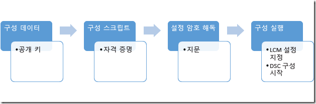

# MOF 파일 보안

>적용 대상: Windows PowerShell 4.0, Windows PowerShell 5.0

DSC에서는 해당 정보가 있는 MOF 파일을 LCM(로컬 구성 관리자)이 필요한 구성을 구현하는 각 노드에 전송하여 보유해야 하는 구성을 대상 노드에 알려줍니다. 
구성에 대한 초기화 매개 변수를 표시합니다. 이 파일은 구성의 세부 정보를 포함하므로 안전하게 보관해야 합니다. 이렇게 하기 위해 사용자의 자격 증명을 확인하도록 LCM을 설정할 수 있습니다 
. 이 항목에서는 인증서로 암호화하여 이러한 자격 증명을 대상 노드에 안전하게 전송하는 방법에 대해 설명합니다.

>**참고:** 이 항목에서는 암호화에 사용되는 인증서에 대해 설명합니다. 암호화의 경우 개인 키의 보안이 항상 유지되고 암호화는 문서에 대한 신뢰를 암시하지 않으므로 자체 서명된 인증서로도 충분합니다. 자체 서명된 인증서
>는 인증 목적으로 사용하면 *안 됩니다*. 인증 목적에는 신뢰할 수 있는 CA(인증 기관)의 인증서를 사용해야 합니다.

## 필수 구성 요소

DSC 구성을 보호하는 데 사용되는 자격 증명을 적절히 암호화하려면 다음의 항목이 있어야 합니다.

* **인증서를 발급하고 배포할 여러 가지 방법**. 이 항목 및 해당 예제에서는 Active Directory 인증 기관을 사용 중이라고 가정합니다. Active Directory 인증서 서비스에 대한 자세한 배경 정보는 
[Active Directory 인증서 서비스 개요](https://technet.microsoft.com/library/hh831740.aspx) 및 
[Windows Server 2008의 Active Directory 인증서 서비스](https://technet.microsoft.com/windowsserver/dd448615.aspx)를 참조하세요.
* **대상 노드에 대한 관리 권한**.
* **각 대상 노드에 해당 개인 저장소에 저장된 암호화 가능 인증서가 있습니다**. Windows PowerShell에서 저장소 경로는 Cert:\LocalMachine\My입니다. 이 항목의 예제에서는 
[기본 인증서 템플릿](https://technet.microsoft.com/library/cc740061(v=WS.10).aspx)에 있는(다른 인증서 템플릿과 함께) "워크스테이션 인증" 템플릿을 사용합니다.
* 이 구성을 대상 노드 외의 컴퓨터에서 실행하려는 경우 **인증서의 공개 키를 내보내고**, 구성을 실행할 컴퓨터로 가져옵니다 
. **공개** 키만 내보내도록 합니다. 개인 키는 안전하게 보관하세요.

## 전체 프로세스

 1. 인증서, 키 및 지문을 설정하여, 각 대상 노드에 인증서의 복사본이 있고, 구성 컴퓨터에 공개 키와 지문이 있도록 합니다.
 2. 공개 키의 경로와 지문을 포함하는 구성 데이터 블록을 만듭니다.
 3. 로컬 구성 관리자가 인증서 및 지문을 사용하여 구성 데이터를 해독하도록 함으로써 대상 노드에 대해 원하는 구성을 정의하고 대상 노드에서 암호 해독을 설정하는 구성 스크립트를 만듭니다.
 4. 로컬 구성 관리자 설정을 설정하고 DSC 구성을 시작할 구성을 실행합니다.



## 인증서 요구 사항

자격 증명 암호화를 적용하려면 DSC 구성을 작성하는 데 사용되는 컴퓨터에서 **신뢰할 수 있는** _대상 노드_에서 공개 키 인증서를 사용할 수 있어야 합니다.
이 공개 키 인증서를 DSC 자격 증명 암호화에 사용하려면 다음과 같은 특정 요구 사항을 충족해야 합니다.
 1. **키 사용**:
   - 'KeyEncipherment' 및 'DataEncipherment'를 포함해야 합니다.
   - '디지털 서명'을 포함하지 _않아야_ 합니다.
 2. **확장된 키 사용**:
   - 문서 암호화(1.3.6.1.4.1.311.80.1)를 포함해야 합니다.
   - 클라이언트 인증(1.3.6.1.5.5.7.3.2) 및 서버 인증(1.3.6.1.5.5.7.3.1)을 포함하지 _않아야_ 합니다.
 3. 인증서에 대한 개인 키를 *대상 노드_에서 사용할 수 있어야 합니다.
 4. 인증서의 **공급자**는 "Microsoft RSA SChannel Cryptographic Provider"여야 합니다.
 
>**권장 모범 사례:** 키 사용 '디지털 서명' 또는 인증 EKU 중 하나를 포함하는 인증서를 사용할 수 있지만 이 경우 암호화 키가 오용되기 쉽고 공격에 취약해질 수 있습니다 
>. 따라서 이러한 키 사용 및 EKU를 포함하지 않고 DSC 자격 증명을 보호하기 위해 특별히 만든 인증서를 사용하는 것이 좋습니다 
>.
  
이러한 기준을 충족하는 _대상 노드_의 모든 기존 인증서는 DSC 자격 증명을 보호하는 데 사용할 수 있습니다.
 
## 인증서 만들기

개인 키는 MOF의 암호를 해독하는 데 사용되기 때문에 보안을 유지해야 합니다. 보안을 유지하는 가장 쉬운 방법은 *대상 노드*에서 개인 키 인증서를 만들고 DSC 구성을 MOF 파일로 컴파일하는 데 사용되는 컴퓨터에 공개 키 인증서를 복사하는 것입니다 
. 다음 예제에서는 인증서를 만들고 공개 키를 내보낸 다음 공개 키를 로컬 인증서 저장소의 루트로 가져옵니다
.

```powershell
# create the cert
$cert = New-SelfSignedCertificate -Type DocumentEncryptionCertLegacyCsp -DnsName 'DscEncryptionCert' 
# export the cert’s public key
$cert | Export-Certificate -FilePath "$env:temp\DscPublicKey.cer"  -Force                                                              
# import the cert’s public key as a trusted root certificate authority so that it is trusted
Import-Certificate -FilePath "$env:temp\DscPublicKey.cer" -CertStoreLocation Cert:\LocalMachine\Root > $null
```

또는 DSC 구성 파일을 컴파일하는 데 사용되는 컴퓨터에서 개인 키 인증서를 만들고 개인 키와 함께 내보낸 다음 _대상 노드_에서 가져올 수 있습니다. 
이것이 Nano 서버에서 DSC 자격 증명 암호화를 구현하는 최신 방법입니다. 전송 중에 개인 키의 보안을 유지해야 합니다.

## 구성 데이터

구성 데이터 블록은 자격 증명을 암호화할지 여부, 암호화 방법 및 기타 정보에 대해 작업을 수행할 대상 노드를 정의합니다. 구성 데이터 블록에 대한 자세한 내용은 [분리 및 환경 데이터 구성](configData.md)를 참조합니다.

자격 증명 암호화와 관련된 각 노드에 대해 구성할 수 있는 요소는 다음과 같습니다.
* **NodeName** - 자격 증명 암호화가 구성되는 대상 노드의 이름입니다.
* **PsDscAllowPlainTextPassword** - 암호화되지 않은 자격 증명을 이 노드로 전달할 수 있는지 여부입니다. 이 요소는 사용하지 **않는 것이 좋습니다**.
* **Thumbprint** - _대상 노드_의 DSC 구성에서 자격 증명의 암호를 해독하는 데 사용되는 인증서의 지문입니다. **이 인증서는 대상 노드의 로컬 컴퓨터 인증서 저장소에 있어야 합니다.**
* **CertificateFile** - _대상 노드_의 인증서를 암호화하는 데 사용할 인증서 파일(공개 키만 포함)입니다. DER로 인코딩된 바이너리 X.509 또는 Base-64로 인코딩된 X.509 형식 인증서 파일 중 하나여야 합니다.

이 예제에서는 명명된 targetNode, 공개 키 인증서 파일 경로(명명된 targetNode.cer) 및 공개 키의 지문에 대해 작업을 수행할 대상 노드를 지정하는 구성 데이터 블록을 보여 줍니다.

```powershell
$ConfigData= @{ 
    AllNodes = @(     
            @{  
                # The name of the node we are describing 
                NodeName = "targetNode" 

                # The path to the .cer file containing the 
                # public key of the Encryption Certificate 
                # used to encrypt credentials for this node 
                CertificateFile = "C:\publicKeys\targetNode.cer" 

         
                # The thumbprint of the Encryption Certificate 
                # used to decrypt the credentials on target node 
                Thumbprint = "AC23EA3A9E291A75757A556D0B71CBBF8C4F6FD8" 
            }; 
        );    
    }
```

## 구성 스크립트

구성 스크립트 자체에서 `PsCredential` 매개 변수를 사용하여 자격 증명이 가능한 가장 짧은 시간 동안 저장되도록 하세요. 제공된 예제를 실행하면 DSC에서 자격 증명을 묻는 메시지를 표시한 다음, 구성 데이터 블록의 대상 노드와 연결된 CertificateFile을 사용하여 MOF 파일을 암호화합니다. 이 코드 예제에서는 보호되는 공유의 파일을 사용자에게 복사합니다.

```
configuration CredentialEncryptionExample 
{ 
    param( 
        [Parameter(Mandatory=$true)] 
        [ValidateNotNullorEmpty()] 
        [PsCredential] $credential 
        ) 
    

    Node $AllNodes.NodeName 
    { 
        File exampleFile 
        { 
            SourcePath = "\\Server\share\path\file.ext" 
            DestinationPath = "C:\destinationPath" 
            Credential = $credential 
        } 
    } 
}
```

## 암호 해독 설정

[`Start-DscConfiguration`](https://technet.microsoft.com/en-us/library/dn521623.aspx)이 작동할 수 있도록 하려면 먼저 각 대상 노드의 로컬 구성 관리자에게 인증서의 지문 확인을 위해 CertificateID 리소스를 사용하여 인증서를 해독하는 데 사용할 인증서를 알려줍니다. 이 예제 함수는 적절한 로컬 인증서를 찾을 것입니다(사용하려는 인증서를 정확히 찾도록 사용자 지정해야 할 수도 있습니다.).

```powershell
# Get the certificate that works for encryption 
function Get-LocalEncryptionCertificateThumbprint 
{ 
    (dir Cert:\LocalMachine\my) | %{
        # Verify the certificate is for Encryption and valid 
        if ($_.PrivateKey.KeyExchangeAlgorithm -and $_.Verify()) 
        { 
            return $_.Thumbprint 
        } 
    } 
}
```

지문으로 인증서가 식별되면 해당 값을 사용하도록 구성 스크립트를 업데이트할 수 있습니다.

```powershell
configuration CredentialEncryptionExample 
{ 
    param( 
        [Parameter(Mandatory=$true)] 
        [ValidateNotNullorEmpty()] 
        [PsCredential] $credential 
        ) 
    

    Node $AllNodes.NodeName 
    { 
        File exampleFile 
        { 
            SourcePath = "\\Server\share\path\file.ext" 
            DestinationPath = "C:\destinationPath" 
            Credential = $credential 
        } 
        
        LocalConfigurationManager 
        { 
             CertificateId = $node.Thumbprint 
        } 
    } 
}
```

## 구성 실행

이 시점에서 두 개의 파일을 출력하는 구성을 실행할 수 있습니다.

 * 로컬 컴퓨터 저장소에 저장되어 있고 지문으로 식별되는 인증서를 사용하여 자격 증명을 해독하도록 로컬 구성 관리자를 구성하는 *.meta.mof 파일. [`Set-DscLocalConfigurationManager`](https://technet.microsoft.com/en-us/library/dn521621.aspx)가 *.meta.mof 파일을 적용합니다.
 * 실제로 구성을 적용하는 MOF 파일. Start-DscConfiguration이 구성을 적용합니다.

다음 명령들은 해당 단계를 수행합니다.

```powershell
Write-Host "Generate DSC Configuration..."
CredentialEncryptionExample -ConfigurationData $ConfigData -OutputPath .\CredentialEncryptionExample

Write-Host "Setting up LCM to decrypt credentials..."
Set-DscLocalConfigurationManager .\CredentialEncryptionExample -Verbose 
 
Write-Host "Starting Configuration..."
Start-DscConfiguration .\CredentialEncryptionExample -wait -Verbose
```

이 예제에서는 대상 노드에 DSC 구성을 밀어넣습니다.
DSC 끌어오기 서버를 사용할 수 있는 경우 이 서버를 사용하여 DSC 구성을 적용할 수도 있습니다.

DSC 끌어오기 서버를 사용하여 DSC 구성을 적용하는 방법에 대한 자세한 내용은 [이 페이지](PullClient.md)를 참조하세요.

## 자격 증명 암호화 모듈 예제

다음은 이러한 모든 단계와 공개 키를 내보내고 복사하는 도우미 cmdlet을 통합하는 전체 예제입니다.

```powershell
# A simple example of using credentials
configuration CredentialEncryptionExample
{
    param(
        [Parameter(Mandatory=$true)]
        [ValidateNotNullorEmpty()]
        [PsCredential] $credential
        )
    

    Node $AllNodes.NodeName
    {
        File exampleFile
        {
            SourcePath = "\\server\share\file.txt"
            DestinationPath = "C:\Users\user"
            Credential = $credential
        }
        
        LocalConfigurationManager
        {
            CertificateId = $node.Thumbprint
        }
    }
}

# A Helper to invoke the configuration, with the correct public key 
# To encrypt the configuration credentials
function Start-CredentialEncryptionExample
{
    [CmdletBinding()]
    param ($computerName)


    [string] $thumbprint = Get-EncryptionCertificate -computerName $computerName -Verbose
    Write-Verbose "using cert: $thumbprint"

    $certificatePath = join-path -Path "$env:SystemDrive\$script:publicKeyFolder" -childPath "$computername.EncryptionCertificate.cer"         

    $ConfigData=    @{
        AllNodes = @(     
                        @{  
                            # The name of the node we are describing
                            NodeName = "$computerName"

                            # The path to the .cer file containing the
                            # public key of the Encryption Certificate
                            CertificateFile = "$certificatePath"

                            # The thumbprint of the Encryption Certificate
                            # used to decrypt the credentials
                            Thumbprint = $thumbprint
                        };
                    );    
    }

    Write-Verbose "Generate DSC Configuration..."
    CredentialEncryptionExample -ConfigurationData $ConfigData -OutputPath .\CredentialEncryptionExample `
        -credential (Get-Credential -UserName "$env:USERDOMAIN\$env:USERNAME" -Message "Enter credentials for configuration") 

    Write-Verbose "Setting up LCM to decrypt credentials..."
    Set-DscLocalConfigurationManager .\CredentialEncryptionExample -Verbose 

    Write-Verbose "Starting Configuration..."
    Start-DscConfiguration .\CredentialEncryptionExample -wait -Verbose

}


#region HelperFunctions

# The folder name for the exported public keys
$script:publicKeyFolder = "publicKeys"

# Get the certificate that works for encryptions
function Get-EncryptionCertificate
{
    [CmdletBinding()]
    param ($computerName)
    $returnValue= Invoke-Command -ComputerName $computerName -ScriptBlock {
            $certificates = dir Cert:\LocalMachine\my

            $certificates | %{
                    # Verify the certificate is for Encryption and valid
                    if ($_.PrivateKey.KeyExchangeAlgorithm -and $_.Verify())
                    {
                        # Create the folder to hold the exported public key
                        $folder= Join-Path -Path $env:SystemDrive\ -ChildPath $using:publicKeyFolder
                        if (! (Test-Path $folder))
                        {
                            md $folder | Out-Null
                        }

                        # Export the public key to a well known location
                        $certPath = Export-Certificate -Cert $_ -FilePath (Join-Path -path $folder -childPath "EncryptionCertificate.cer") 

                        # Return the thumbprint, and exported certificate path
                        return @($_.Thumbprint,$certPath);
                    }
                  }
        }
    Write-Verbose "Identified and exported cert..."
    # Copy the exported certificate locally
    $destinationPath = join-path -Path "$env:SystemDrive\$script:publicKeyFolder" -childPath "$computername.EncryptionCertificate.cer"
    Copy-Item -Path (join-path -path \\$computername -childPath $returnValue[1].FullName.Replace(":","$"))  $destinationPath | Out-Null

    # Return the thumbprint
    return $returnValue[0]
}

Start-CredentialEncryptionExample
```


<!--HONumber=Mar16_HO5-->


