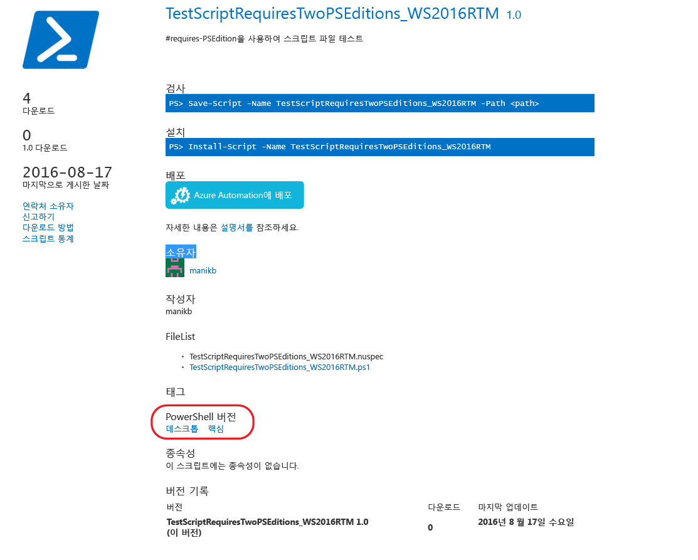
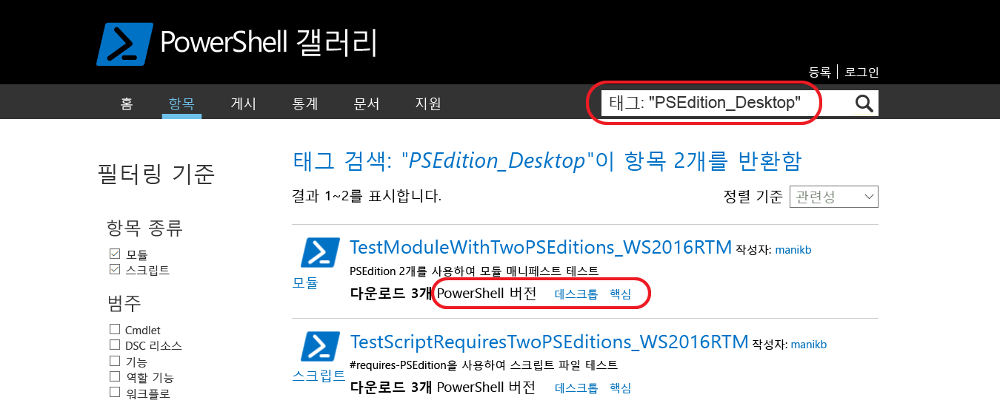

# 호환되는 PowerShell 버전이 있는 항목

버전 5.1부터 PowerShell은 다양한 기능 집합 및 플랫폼 호환성을 나타내는 다양한 버전으로 사용 가능합니다.

- **Desktop Edition:** .NET Framework에서 구축되며 Server Core 및 Windows 데스크톱과 같은 전체 설치 공간 버전의 Windows에서 실행되는 PowerShell 버전을 대상으로 하는 스크립트 및 모듈과의 호환성을 제공합니다.
- **Core Edition:** .NET Core에서 구축되며 Nano Server 및 Windows IoT와 같은 축소된 설치 공간 버전의 Windows에서 실행되는 PowerShell 버전을 대상으로 하는 스크립트 및 모듈과의 호환성을 제공합니다.

## PowerShell 갤러리는 지원되는 PSEditions 메타데이터를 추출하며 특정 PowerShell 버전에 대해 호환되는 항목을 필터링할 수 있습니다.

항목에 호환되는 PSEditions가 지정된 경우 항목 표시 페이지 및 항목 결과에 'PowerShell 버전'의 일부로 표시됩니다.

## 갤러리 UI에서 PowerShellCore에 적용되는 항목 검색

Tags:"PSEdition_Desktop" 및 Tags:"PSEdition_Core"를 사용하여 PowerShell 갤러리에 있는 항목을 필터링합니다.

### Tags:"PSEdition_Core"를 사용하여 PowerShell Core Edition과 호환되는 항목을 검색합니다.

### Tags:"PSEdition_Desktop"을 사용하여 PowerShell Desktop Edition과 호환되는 항목을 검색합니다.

## 호환되는 PowerShell 버전이 있는 항목을 작성 및 찾는 방법에 대한 자세한 내용

- [PSEditions가 있는 모듈](../../concepts/module-psedition-support.md)
- [PSEditions가 있는 스크립트](../../concepts/script-psedition-support.md)