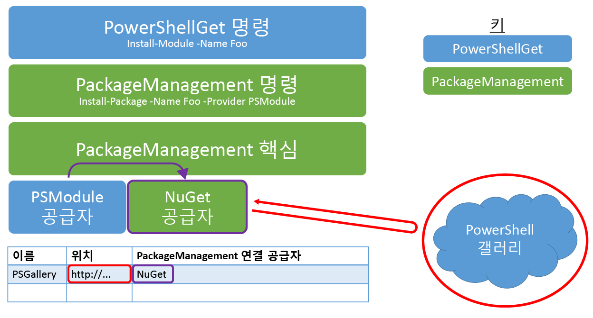

# 질문과 대답

## PowerShell 모듈이란?

PowerShell 모듈은 일부 PowerShell 기능을 포함하는 재사용 가능한 패키지입니다. PowerShell의 모든 항목(함수, 변수, DSC 리소스 등)을 모듈에 패키징할 수 있습니다. 일반적으로 모듈은 특정 경로에 저장된 특정 파일 형식을 포함하는 폴더입니다. 몇 가지 유형의 PowerShell 모듈이 있습니다.

## PowerShell 스크립트란?

PowerShell 스크립트는 다시 사용 및 공유할 수 있도록 .ps1 파일에 저장된 일련의 명령입니다. PowerShell 워크플로도 일련의 작업을 간략하게 설명하고 해당 작업 순서를 제공하는 PowerShell 스크립트입니다. 자세한 내용은 [PowerShell 워크플로 시작](https://technet.microsoft.com/en-us/library/jj134242.aspx)을 참조하세요.

## PowerShell 스크립트와 PowerShell 모듈의 차이점은 무엇인가요?

일반적으로 모듈이 공유에 더 효과적이지만 워크플로와 스크립트를 커뮤니티에 기여하기 쉽도록 스크립트 공유를 설정합니다. 자세한 내용은 다음 블로그를 참조하세요.

- [Don't Write Scripts, Write PowerShell Modules](https://blogs.technet.microsoft.com/heyscriptingguy/2011/06/27/dont-write-scripts-write-powershell-modules/)(스크립트가 아니라 PowerShell 모듈을 작성하세요.)
- [Understanding PowerShell Modules](https://blogs.technet.microsoft.com/heyscriptingguy/2015/07/10/understanding-powershell-modules/)(PowerShell 모듈 이해)

## PowerShell 갤러리에 게시하려면 어떻게 하나요?

갤러리에 항목을 게시하려면 먼저 PowerShell 갤러리에 계정을 등록해야 합니다. 항목을 게시하려면 등록 시 제공되는 NuGetApiKey가 필요하기 때문입니다. 등록하려면 개인, 회사 또는 학교 계정을 사용하여 PowerShell 갤러리에 로그인합니다. 일회성 등록 프로세스는 최초 로그인 시 필요합니다. 그 후에는 프로필 페이지에서 NuGetApiKey를 사용할 수 있습니다.

갤러리에 등록했으면 [Publish-Module](https://go.microsoft.com/fwlink/?LinkID=760387&clcid=0x409) 또는 [Publish-Script](https://go.microsoft.com/fwlink/?LinkID=760387&clcid=0x409) cmdlet을 사용하여 갤러리에 항목을 게시합니다. 이러한 cmdlet을 실행하는 방법에 대한 자세한 내용은 게시 탭이나 [Publish-Module](https://go.microsoft.com/fwlink/?LinkID=760387&clcid=0x409) 및 [Publish-Script](https://go.microsoft.com/fwlink/?LinkID=760387&clcid=0x409) 설명서를 참조하세요.

**항목을 설치하거나 저장하기 위해 갤러리에 등록 또는 로그인할 필요는 없습니다.**

## PowerShell 갤러리에 항목을 게시하려고 했을 때 "요청을 처리하지 못했습니다. '지정된 API 키가 잘못되었거나 지정된 패키지에 액세스할 수 있는 권한이 없습니다.' 원격 서버에서 (403) 사용할 수 없음 오류를 반환했습니다."라는 오류가 발생했습니다. 어떤 의미입니까?

이 오류는 다음과 같은 이유로 발생할 수 있습니다.

- **지정된 API 키가 잘못되었습니다.**
     계정에서 유효한 API 키를 지정했는지 확인합니다. API 키를 가져오려면 프로필 페이지를 봅니다.
- **지정된 항목 이름이 사용자 소유가 아닙니다.**
     API 키가 올바른지 확인했으면 사용하려는 이름과 동일한 이름의 항목이 있는 것일 수 있습니다. 소유자가 항목을 목록에서 제거했을 수 있으며, 이 경우 검색 결과에 표시되지 않습니다. 동일한 이름의 항목이 이미 있는지 확인하려면 브라우저를 열고 항목의 세부 정보 페이지(`https://www.powershellgallery.com/packages/<itemName>`)로 이동합니다. 예를 들어 `https://www.powershellgallery.com/packages/pester`로 직접 이동하면 목록에 있는지 여부에 관계없이 Pester 모듈의 세부 정보 페이지가 표시됩니다. 충돌하는 이름의 항목이 이미 있고 목록에 표시되지 않는 경우 다음을 수행할 수 있습니다.
    - 항목에 대해 다른 이름을 선택합니다.
    - 기존 항목의 소유자에게 문의합니다.

## 어제는 로그인할 수 있었는데 내 개인 계정으로 로그인할 수 없는 이유는 무엇인가요?

갤러리 계정은 기본 메일 별칭의 변경을 허용하지 않습니다. 자세한 내용은 [Microsoft 메일 별칭](https://windows.microsoft.com/en-us/windows/outlook/add-alias-account)을 참조하세요.

## 항목 탭에서 범주 확인란을 모두 선택해도 모든 갤러리 항목이 표시되지 않는 이유는 무엇인가요?

범주 확인란 선택은 "이 범주에 있는 모든 항목을 표시"하는 것입니다. 선택한 범주에 있는 항목만 표시됩니다. 마찬가지로, 모든 범주 확인란 선택은 "모든 범주에 있는 모든 항목을 표시"하는 것입니다. 하지만 갤러리에 있는 일부 항목은 나열된 범주에 속하지 않으므로 결과에 표시되지 않습니다. 갤러리에 있는 모든 항목을 보려면 모든 범주의 선택을 취소하거나 항목 탭을 다시 선택합니다.

## PowerShell 갤러리에 모듈을 게시하기 위한 요구 사항은 무엇인가요?

모든 종류의 PowerShell 모듈(스크립트 모듈, 이진 모듈 또는 매니페스트 모듈)을 갤러리에 게시할 수 있습니다. 모듈을 게시하려면 PowerShellGet에 버전, 설명, 작성자, 사용 허가 방법 등의 몇 가지 정보가 필요합니다. 이 정보는 게시 프로세스의 일부로 *모듈 매니페스트*(.psd1) 파일 또는 [**Publish-Module**](https://go.microsoft.com/fwlink/?LinkID=760387&clcid=0x409) cmdlet의 **LicenseUri** 매개 변수 값에서 읽어옵니다. 갤러리에 게시된 모든 모듈에는 모듈 매니페스트가 있어야 합니다. 매니페스트에 다음 정보가 포함된 모든 모듈을 갤러리에 게시할 수 있습니다.

- 버전
- 설명
- Author
- 매니페스트의 **PrivateData** 섹션이나 [**Publish-Module**](https://go.microsoft.com/fwlink/?LinkID=760387&clcid=0x409) cmdlet의 **LicenseUri** 매개 변수에 포함된 모듈 사용 조건에 대한 URI입니다.

## 올바른 형식의 모듈 매니페스트를 만들려면 어떻게 하나요?

모듈 매니페스트를 만드는 가장 쉬운 방법은 [**New-ModuleManifest**](https://go.microsoft.com/fwlink/?LinkID=760387&clcid=0x409) cmdlet을 실행하는 것입니다. PowerShell 5.0 이상에서 New-ModuleManifest는 **ProjectUri**, **LicenseUri**, **Tags** 등의 유용한 메타데이터에 빈 필드를 사용하여 올바른 형식의 모듈 매니페스트를 생성합니다. 단순히 빈 칸을 채우거나 생성된 매니페스트를 올바른 형식의 예로 사용합니다.

모든 필수 메타데이터 필드가 올바르게 채워졌는지 확인하려면 [**Test-ModuleManifest**](https://go.microsoft.com/fwlink/?LinkID=760387&clcid=0x409) cmdlet을 사용합니다.

모듈 매니페스트 파일 필드를 업데이트하려면 [**Update-ModuleManifest**](https://go.microsoft.com/fwlink/?LinkID=760387&clcid=0x409) cmdlet을 사용합니다.

## 갤러리에 스크립트를 게시하기 위한 요구 사항은 무엇인가요?

모든 종류의 PowerShell 스크립트(스크립트 또는 워크플로)를 갤러리에 게시할 수 있습니다. 스크립트를 게시하려면 PowerShellGet에 버전, 설명, 작성자, 사용 허가 방법 등의 몇 가지 정보가 필요합니다. 이 정보는 게시 프로세스의 일부로 스크립트 파일의 *PSScriptInfo* 섹션이나 [**Publish-Script**](https://go.microsoft.com/fwlink/?LinkID=760387&clcid=0x409) cmdlet의 **LicenseUri** 매개 변수 값에서 읽어옵니다. 갤러리에 게시된 모든 스크립트에는 메타데이터 정보가 있어야 합니다. PSScriptInfo 섹션에 다음 정보가 포함된 모든 스크립트를 갤러리에 게시할 수 있습니다.

- 버전
- 설명
- Author
- 스크립트의 **PSScriptInfo** 섹션이나 [**Publish-Script**](https://go.microsoft.com/fwlink/?LinkID=760387&clcid=0x409) cmdlet의 **LicenseUri** 매개 변수에 포함된 모듈 사용 조건에 대한 URI입니다.

## 검색하려면 어떻게 하나요?

텍스트 상자에 찾으려는 내용을 입력합니다. 예를 들어 Azure SQL과 관련된 모듈을 찾으려는 경우 "azure sql"을 입력하면 됩니다. 검색 엔진은 제목, 설명 및 메타데이터를 비롯하여 게시된 모든 항목에서 해당 키워드를 검색합니다. 그런 다음 가중치가 적용된 품질 점수를 기준으로 가장 가까운 일치 항목을 표시합니다. 다음 필드에 대한 검색 쿼리에 필드:"값" 구문을 사용하여 특정 필드를 기준으로 검색할 수도 있습니다.

- 태그
- 함수
- Cmdlet
- DscResources
- PowerShellVersion

따라서 예를 들어 PowerShellVersion:"2.0"을 검색하면 해당 모듈/스크립트 매니페스트에 따라 PowerShellVersion 2.0과 호환되는 결과만 표시됩니다.

## 올바른 형식의 스크립트 파일을 만들려면 어떻게 하나요?

올바르 형식의 스크립트 파일을 만드는 가장 쉬운 방법은 [**New-ScriptFileInfo**](https://go.microsoft.com/fwlink/?LinkID=760387&clcid=0x409) cmdlet을 실행하는 것입니다. PowerShell 5.0에서 New-ScriptFileInfo는 **ProjectUri**, **LicenseUri**, **Tags** 등의 유용한 메타데이터에 빈 필드를 사용하여 올바른 형식의 스크립트 파일을 생성합니다. 단순히 빈 칸을 채우거나 생성된 스크립트 파일을 올바른 형식의 예로 사용합니다.

모든 필수 메타데이터 필드가 올바르게 채워졌는지 확인하려면 [**Test-ScriptFileInfo**](http://go.microsoft.com/fwlink/?LinkID=760387&clcid=0x409) cmdlet을 사용합니다.

스크립트 메타데이터 필드를 업데이트하려면 [**Update-ScriptFileInfo**](https://go.microsoft.com/fwlink/?LinkID=760387&clcid=0x409) cmdlet을 사용합니다.

## 다른 어떤 유형의 PowerShell 모듈이 있나요?

PowerShell 모듈이란 용어는 실제 기능을 구현하는 파일도 가리킵니다. 스크립트 모듈 파일(.psm1)에는 PowerShell 코드가 들어 있습니다. 이진 모듈 파일(.dll)에는 컴파일된 코드가 들어 있습니다.

모듈을 이해하는 한 가지 방법은 다음과 같습니다. 모듈을 캡슐화하는 폴더는 모듈 폴더입니다. 모듈 폴더에는 폴더의 내용을 설명하는 모듈 매니페스트(.psd1)가 포함될 수 있습니다. 실제로 작업을 수행하는 파일은 스크립트 모듈 파일(.psm1) 및 이진 모듈 파일(.dll)입니다. DSC 리소스는 특정 하위 폴더에 있으며 스크립트 모듈 파일 또는 이진 모듈 파일로 구현됩니다.

갤러리에 있는 모든 모듈에는 모듈 매니페스트가 포함되고, 이러한 모듈에는 대부분 스크립트 모듈 파일 또는 이진 모듈 파일이 포함됩니다. 이러한 다양한 의미 때문에 모듈 용어가 혼동을 줄 수 있습니다. 명시적으로 달리 언급되지 않은 경우 이 페이지에서 모듈 단어는 모두 이러한 파일이 포함된 모듈 폴더를 가리킵니다.

## PackageManagement는 PowerShellGet과 어떤 관계가 있나요? (개괄적인 답변)

PackageManagement는 모든 패키지 관리자 작업에 사용되는 공용 인터페이스입니다. PowerShell 모듈, MSI, Ruby 보석, NuGet 패키지 또는 Perl 모듈 중 어떤 것을 처리하든 간에 PackageManagement 명령(Find-Package 및 Install-Package)을 사용하여 찾아서 설치할 수 있어야 합니다. PackageManagement는 PackageManagement에 연결하는 각 패키지 관리자에 대한 패키지 공급자를 포함하여 이 작업을 수행합니다. 공급자가 실제 작업을 모두 수행합니다. 리포지토리에서 콘텐츠를 가져와 로컬에 설치합니다. 패키지 공급자가 지정된 패키지 유형에 대한 기존 패키지 관리자 도구를 단순히 래핑하는 경우도 많습니다.

PowerShellGet은 PowerShell 항목에 대한 패키지 관리자입니다. PackageManagement를 통해 PowerShellGet 기능을 노출하는 PSModule 패키지 공급자가 있습니다. 이 때문에 [Install-Module](https://go.microsoft.com/fwlink/?LinkID=760387&clcid=0x409) 또는 Install-Package -Provider PSModule을 실행하여 PowerShell 갤러리에서 모듈을 설치할 수 있습니다. [Update-Module](https://go.microsoft.com/fwlink/?LinkID=760387&clcid=0x409) 및 [Publish-Module](https://go.microsoft.com/fwlink/?LinkID=760387&clcid=0x409)을 비롯한 특정 PowerShellGet 기능은 PackageManagement 명령을 통해 액세스할 수 있습니다.

요약하자면, PowerShellGet은 전적으로 PowerShell 콘텐츠에 대한 프리미엄 패키지 관리 환경 사용에 중점을 둡니다. PackageManagement는 하나의 일반적인 도구 집합을 통해 모든 패키지 관리 환경을 노출하는 데 중점을 둡니다. 이 응답이 만족스럽지 않은 경우 이 문서의 맨 아래에 있는 **PackageManagement는 실제로 PowerShellGet과 어떤 관계가 있나요?** 섹션에 자세한 답변이 나와 있습니다.

자세한 내용은 [PackageManagement 프로젝트 페이지](https://oneget.org/)를 참조하세요.

## NuGet은 PowerShellGet과 어떤 관계가 있나요?

PowerShell 갤러리는 [NuGet 갤러리](https://www.nuget.org/)의 수정된 버전입니다. PowerShellGet은 NuGet 공급자를 사용하여 PowerShell 갤러리 등의 NuGet 기반 리포지토리로 작업합니다.

유효한 모든 NuGet 리포지토리 또는 파일 공유에 대해 PowerShellGet을 사용할 수 있습니다. [**Register-PSRepository**](https://go.microsoft.com/fwlink/?LinkID=760387&clcid=0x409) cmdlet을 실행하여 리포지토리를 추가하면 됩니다.

## 갤러리 작업에 NuGet.exe를 사용할 수 있다는 의미인가요?

예.

## PackageManagement는 실제로 PowerShellGet과 어떤 관계가 있나요? (기술 세부 정보)

내부적으로 PowerShellGet은 PackageManagement 인프라를 많이 활용합니다.

PowerShell cmdlet 계층에서 [Install-Module](https://go.microsoft.com/fwlink/?LinkID=760387&clcid=0x409)은 실제로 Install-Package -Provider PSModule을 둘러싼 씬 래퍼입니다.

PackageManagement 패키지 공급자 계층에서 PSModule 패키지 공급자는 실제로 다른 PackageManagement 패키지 공급자를 호출합니다. 예를 들어 NuGet 기반 갤러리(예: PowerShell 갤러리)로 작업하는 경우 PSModule 패키지 공급자는 NuGet 패키지 공급자를 사용하여 리포지토리에서 작업합니다.

그림 1: PowerShellGet 아키텍처

## PowerShellGet을 실행하는 데 필요한 사항은 무엇인가요?

일반적으로 최신 버전의 PowerShellGet 모듈을 선택하는 것이 좋습니다(.NET 4.5가 필요함).

**PowerShellGet** 모듈을 사용하려면 **PowerShell 3.0 이상**이 있어야 합니다.

따라서 **PowerShellGet**에는 다음 운영 체제 중 하나가 필요합니다.

- Windows 10
- Windows 8.1 Pro
- Windows 8.1 Enterprise
- Windows 7 SP1
- Windows Server 2016
- Windows Server 2012 R2
- Windows Server 2008 R2 SP1

**PowerShellGet**을 사용하려면 .NET Framework 4.5 이상도 있어야 합니다. .NET Framework 4.5 이상은 [여기](https://msdn.microsoft.com/en-us/library/5a4x27ek.aspx)에서 설치할 수 있습니다.

## 나중에 게시할 항목의 이름을 예약할 수 있나요?

항목 이름을 무단 사용할 수는 없습니다. 기존 항목이 해당 항목에 더 맞는 이름을 사용한 경우 [항목의 소유자에게 문의](psgallery_contacting_item_owners.md)하세요. 몇 주 내에 응답을 받지 못한 경우 지원 담당자에게 문의하면 PowerShell 갤러리 팀에서 살펴보겠습니다.

## 항목의 소유권을 클레임하려면 어떻게 하나요?

자세한 내용은 [PowerShellGallery.com에서 항목 소유자 관리](Managing-Item-Owners.md)를 참조하세요.

## 내 항목 라이선스를 위반하는 항목 소유자를 처리하려면 어떻게 하나요?

PowerShell 커뮤니티에서 협력하여 항목 소유자와 다른 항목의 소유자 간에 발생할 수 있는 분쟁을 해결하는 것이 좋습니다.  PowerShellGallery.com 관리자가 중재하기 전에 작성된 [분쟁 해결 프로세스](psgallery_dispute_resolution.md)를 따라야 합니다.

