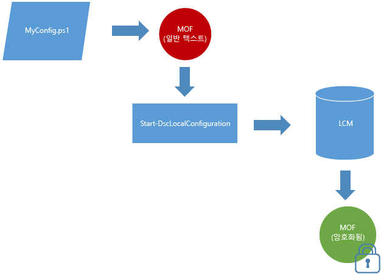

# 기본적으로 암호화된 MOF 문서

구성 문서에는 중요한 정보가 포함되어 있습니다. 이전 버전의 DSC에서는 구성 내에서 자격 증명을 보호하려면 인증서를 배포하고 관리해야 했습니다. 많은 경우 엄청한 관리 부담이 있었으며 필요한 모든 작업을 수행해도 일부 구성 정보는 보호되지 않았고 보호할 수 없었습니다. 

**모든 구성 MOF가 기본적으로 보호**되기 때문에 더 이상 그럴 이유가 없습니다. 인증서나 메타 구성 설정이 필요 없습니다. 구성 MOF가 대상 노드의 LCM(로컬 구성 관리자)에 의해 디스크에 저장되면 언제든지 암호화됩니다. MOF는 [DPAPI](https://msdn.microsoft.com/en-us/library/ms995355.aspx)를 사용하여 암호화됩니다. **참고:** 구성 스크립트에 의해 생성된 MOF는 암호화되지 않습니다.

**예:** 밀어넣기 모드의 암호화 

암호를 암호화하는 데 인증서 방법을 이미 사용하고 있는 경우 또는 암호에 추가 보안이 필요한 경우 [기존의 인증서 기반 암호화 방법](https://msdn.microsoft.com/en-us/powershell/dsc/securemof)이 계속 작동합니다. 결과는 DPAPI를 사용하여 완벽하게 암호화된 MOF 문서이며 추가로 이 문서 내에서 암호가 암호화되었습니다.

이 암호화는 구성 MOF 문서(pending.mof, current.mof, previous.mof 및 부분 MOF)에만 적용됩니다. 메타 구성 MOF는 비밀 정보가 포함될 가능성이 적기 때문에 일반 텍스트로 저장됩니다.

<!--HONumber=Jul16_HO1-->

