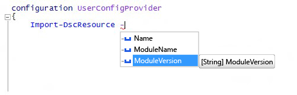

# Import-DscResource 키워드에서 -ModuleVersion 매개 변수 지원

DSC 구성을 작성할 때 사용할 수 있는 `Import-DscResource` 동적 키워드에 새로운 매개 변수를 추가했습니다. 이제 구성 작성자는 DSC 리소스를 로드할 모듈 버전을 정확하게 지정할 수 있습니다. 새 키워드의 구문은 다음과 같습니다.

```powershell
Import-DscResource [-Name <ResourceName(s)>] [-ModuleName <ModuleName(s)>] [-ModuleVersion <ModuleVersion>]
```

* **Name**: 가져오려는 리소스 하나 이상의 이름입니다.
* **ModuleName**: 가져오려는 모듈 하나 이상의 모듈 이름 또는 ModuleSpecification 개체입니다.
* **ModuleVersion**: 가져오려는 모듈의 버전입니다. 사용될 경우 ModuleName은 이름으로 하나의 모듈만 나타내야 합니다. 

Windows PowerShell ISE에서는 IntelliSense로 표시됩니다.



**참고**: `–ModuleVersion` 매개 변수는 `–ModuleName` 매개 변수와 함께만 사용할 수 있습니다. `–Name` 매개 변수만 사용하여 리소스 이름과 함께 사용할 수는 없습니다.

이전에는 DSC 리소스를 로드할 때 모듈 버전을 지정하려면 모듈 사양 개체(예: `–ModuleName @{ModuleName="UserConfigProvider";ModuleVersion="3.0"}`)만 사용했습니다.

<!--HONumber=Mar16_HO2-->
