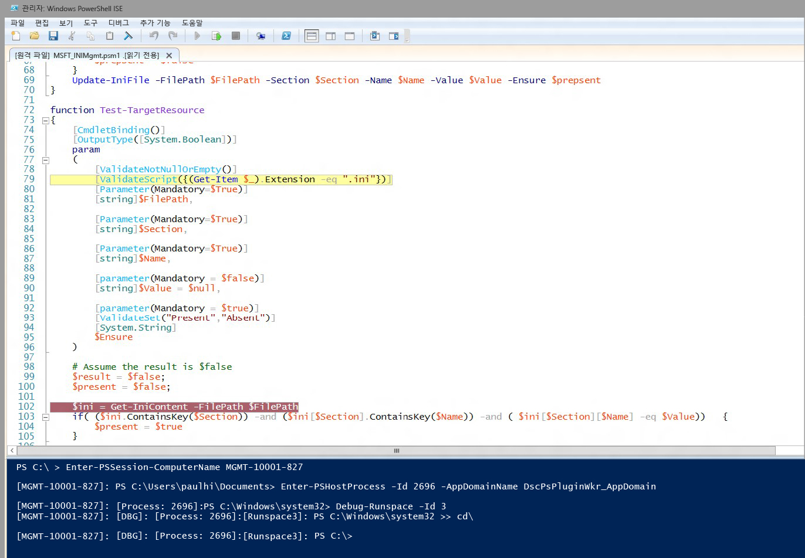

# DSC 리소스 스크립트 디버깅
WMF 5.0 Production Preview에서는 대상 노드에서 실행되는 DSC 리소스 스크립트 디버깅을 지원합니다. 이전 WMF 5.0 릴리스에서는 로컬 프로세스에 연결(Get-PSHostProcessInfo, Enter-PSHostProcessInfo, Exit-PSHostProcessInfo)하고 프로세스의 모든 runspace를 열거하며 프로세스의 임의 runspace를 디버그(Get-Runspace, Debug-Runspace)하는 기능과 함께 고급 스크립트 디버깅 기능을 추가했습니다.

DSC 리소스 스크립트 디버깅은 두 개의 새 cmdlet을 추가하여 이 작업을 빌드합니다.

##구문
**Enable-DscDebug**
Enable-DscDebug \[-BreakAll\] \[-CimSession &lt;CimSession\[\]&gt;\] \[-ThrottleLimit &lt;int&gt;\] \[-AsJob\] \[-WhatIf\] \[-Confirm\] \[&lt;CommonParameters&gt;\]

**Disable-DscDebug**
Disable-DscDebug \[-CimSession &lt;CimSession\[\]&gt;\] \[-ThrottleLimit &lt;int&gt;\] \[-AsJob\] \[-WhatIf\] \[-Confirm\] \[&lt;CommonParameters&gt;\]

##일반적인 워크플로


```PowerShell
PS C:\Test> Enable-DscDebug –BreakAll

PS C:\Test> Start-DscConfiguration -path .\TestConfig2 -Wait -Verbose
VERBOSE: Perform operation 'Invoke CimMethod' with following parameters, ''namespaceName' = root/Microsoft/Windows/DesiredStateConfiguration,'className' = MSFT\_DSCLocalConfigurationManager,'methodName' = SendConfigurationApply'.
VERBOSE: An LCM method call arrived from computer MGMT-10001-827 with user sid S-1-5-21-397955417-626881126-188441444-3860663.
VERBOSE: [MGMT-10001-827]: LCM: [ Start Set ]
WARNING: [MGMT-10001-827]: [DSCEngine] Warning LCM is in Debug 'ResourceScriptBreakAll' mode. Resource script processing will be stopped to wait for PowerShell script debugger to attach.
VERBOSE: [MGMT-10001-827]: [DSCEngine] Importing the module C:\WINDOWS\system32\WindowsPowerShell\v1.0\Modules\PSDesiredStateConfiguration\DscResources\MSFT_EnvironmentResource\MSFT_EnvironmentResource.psm1 in force mode.
VERBOSE: [MGMT-10001-827]: LCM: [ Start Resource ] [[Environment]e1]
VERBOSE: [MGMT-10001-827]: LCM: [ Start Test ] [[Environment]e1]
VERBOSE: [MGMT-10001-827]: [[Environment]e1] Importing the module MSFT_EnvironmentResource in force mode.
WARNING: [MGMT-10001-827]: [[Environment]e1] Resource is waiting for PowerShell script debugger to attach. Use the following commands to begin debugging this resource script:
Enter-PSSession -ComputerName MGMT-10001-827 -Credential <credentials>
Enter-PSHostProcess -Id 2640 -AppDomainName DscPsPluginWkr_AppDomain
Debug-Runspace -Id 3

PS C:\Test> Disable-DscDebug
```
이제 이러한 각 명령 및 용도에 대해 살펴보겠습니다.

**Enable-DscDebug –BreakAll**
BreakAll을 사용하는 Enable-DscDebug cmdlet은 모두 중단 모드에서 Get-TargetResource, Set-TargetResource 및 Test-TargetResource 스크립트를 실행하도록 DSC LCM을 구성합니다. 즉, 스크립트가 첫 번째 스크립트 문에서 중지하고 디버거가 연결될 때까지 대기합니다. 그런 다음 Windows PowerShell 원격을 사용하여 대상 컴퓨터에 연결하고 Windows PowerShell 디버거를 LCM 프로세스 및 runspace에 연결하여 스크립트를 디버그할 수 있습니다. 이 작업을 수행한 후 중단점을 설정하고 일반적인 Windows PowerShell 방식으로 스크립트를 디버그할 수 있습니다.

**Start-DscConfiguration -path .\TestConfig2 -Wait -Verbose**

이 명령은 DSC를 시작하지만 위에 설명된 대로 대상 노드에서 디버그 모드가 활성화되어 있으므로 LCM이 실행되는 첫 번째 DSC 리소스에서 중지합니다.

디버깅 세션을 시작하여 Start-DscConfiguration 실행 후 경고 메시지에 표시된 명령을 실행하려면 클라이언트 Windows PowerShell 스크립트 디버거를 적절한 컴퓨터, 프로세스, 응용 프로그램, 도메인 및 runspace에 연결합니다.

* 필요에 따라 Windows PowerShell 원격을 사용하여 대상 컴퓨터에 연결하려면 다음 명령을 실행합니다. 원격 데스크톱 연결이 이미 있는 경우 이 명령을 건너뜁니다.
```PowerShell
Enter-PSSession -ComputerName MGMT-10001-827
```
* 다음 명령은 리소스 스크립트가 실행되고 있는 DSC LCM 호스트 프로세스 및 앱 도메인에 연결합니다.
```PowerShell
Enter-PSHostProcess -Id 2640 -AppDomainName DscPsPluginWkr\_AppDomain
```
*  마지막으로 다음 명령을 사용하면 스크립트를 실행하는 DSC runspace를 디버그할 수 있습니다.
```PowerShell
Debug-Runspace -Id 3
```


디버거를 연결했으면 스크립트 실행을 조사하려는 줄 중단점을 설정하고 **continue** 디버거 명령을 실행하여 스크립트가 디버거에서 실행되도록 합니다. 디버깅이 완료되면 **quit** 디버거 명령을 입력하여 스크립트 실행을 중지하거나 **detach** 디버거 명령을 실행하여 스크립트가 디버거 없이 계속 실행되도록 할 수 있습니다.

***모든*** 리소스 스크립트는 디버거에서 중지됩니다. 즉, Test-TargetResoruce, Set-TargetResource 및 Get-TargetResource 스크립트가 각각 차례로 디버거에서 중지된다는 의미입니다. 리소스 스크립트를 디버그하지 않으려면 runspace에서 다음 명령을 실행하여 디버그 모드를 종료할 수 있습니다.

Disable-RunspaceDebug -RunspaceId 3

또는 Debug-Runspace를 실행하여 디버거를 연결한 다음 바로 **detach** 명령을 실행할 수 있습니다.

리소스 스크립트 디버깅을 완료한 후에는 다음 명령을 실행하여 DSC 구성을 중지해야 합니다.

Stop-DscConfiguration –Force

마지막으로 Disable-DscDebug cmdlet을 사용하여 디버그 모드를 사용하지 않도록 대상 컴퓨터 LCM을 다시 구성해야 합니다.<!--HONumber=Mar16_HO2-->
